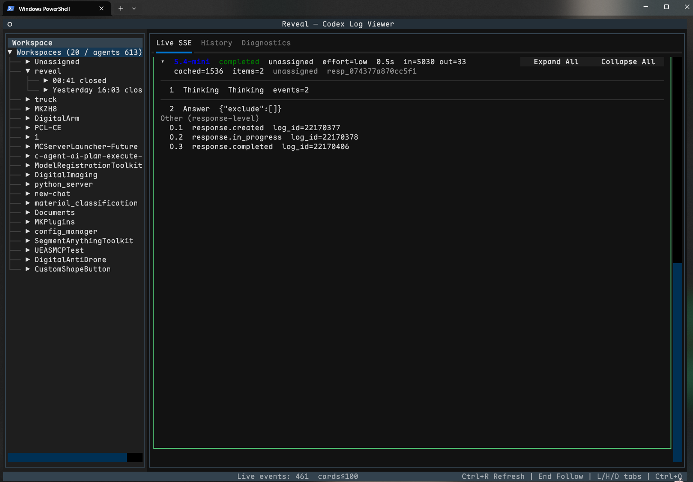

# Reveal

Codex log viewer TUI — browse rollout sessions and monitor Responses API SSE streams in real time.



**Version:** 1.0.0

## Requirements

- Python **≥ 3.13**
- [uv](https://docs.astral.sh/uv/) (preferred)
- Local Codex Desktop data:
  - SSE log DB: `%USERPROFILE%\.codex\logs_2.sqlite`
  - Rollout sessions: `%USERPROFILE%\.codex\sessions\`

Reveal opens the log DB **read-only**. It does not modify Codex state.

## Install & run

### From a clone (development)

```powershell
git clone https://github.com/AresConnor/codex_reveal.git
cd codex_reveal
uv sync
uv run reveal
```

Equivalent:

```powershell
uv run python -m reveal
```

### Tool install (uv)

```powershell
uv tool install git+https://github.com/AresConnor/codex_reveal.git
reveal
```

Upgrade later:

```powershell
uv tool upgrade reveal
```

## Layout

```text
┌──────────────────┬──────────────────────────────────────────┐
│ Workspace tree   │  Live  |  History  |  Diagnostics        │
│  workspace       │                                          │
│    session       │  Response cards (Live)                   │
│      root        │    1 Thinking                            │
│      subagent    │    2 Tool Call                           │
│                  │    3 Answer                              │
└──────────────────┴──────────────────────────────────────────┘
```

| Panel | Behavior |
| --- | --- |
| **Left tree** | workspace → root session → agents (`thread_id` identity). Closed agents stay visible (dim). |
| **Live** | One bordered `ResponseCard` per Responses API response. Semantic items expand independently. |
| **History** | Loads only when an **agent** node is selected (not workspace/session aggregates). |
| **Diagnostics** | Whitespace/token anomaly analyzer + routing metrics (confirmed / inferred / unassigned / unresolved / lag). |

## Live SSE

### Card model

```text
response.created
  → output items (thinking / tool / answer / other)
  → response.completed | failed | incomplete
```

- **Card boundary** = one Responses API response (not an agent).
- **Items** are numbered `1..N` from `output_index` (protocol is 0-based).
- Each item owns its raw SSE children and assembled semantic view.
- Response-wide events without an item land in a card-level **Other** section.

### Attribution

| Confidence | Meaning |
| --- | --- |
| `confirmed` | Strong lifecycle / rollout evidence |
| `inferred` | Safe correlation (yellow badge) |
| `unassigned` | No safe mapping — **never** assigned by “only one active response” guessing |

Item streams without `response_id` are joined via generation-family id matching (`resp_` / `rs_` / `msg_` / `ctc_` share a hex family) when unique.

### Thinking / reasoning

Codex reasoning items usually ship:

| Field | Role |
| --- | --- |
| `summary[]` / `reasoning_summary_*` | **Only plaintext** thinking shown in Text mode |
| `content` | Typically empty |
| `encrypted_content` | Full body; not decryptable in Reveal |

Multi-part summaries (`summary_index` 0..N) are assembled as separate lines. When encrypted content is present, Text mode notes:

```text
(provider encrypted reasoning body; plaintext summary only)
```

Switch **Text / Raw** on a thinking item to inspect verbatim SSE.

### Tool results

- Tool inputs stream from SSE deltas.
- Execution results join only on exact `call_id` from rollout JSONL.
- Result blocks are labeled **rollout-derived**.

### Content size

| Threshold | Behavior |
| --- | --- |
| ≤ 200 lines **and** ≤ 64 KiB | Inline text |
| Above either limit | Virtual 18-row viewport + fullscreen search (`f` / content screen) |

### Follow & retention

| Concern | Behavior |
| --- | --- |
| Follow | Pins to bottom when already at bottom; scroll away pauses; `End` resumes |
| Pause indicator | Shows new/update counts while not following |
| Startup | Bounded backfill (~20 recent completed + in-flight; ≤ 50k rows) then high-water live poll |
| Retention | Card limits `100 / 200 / 500 / 1000` via `[` / `]`; active cards are never evicted |

## Keys

| Key | Action |
| --- | --- |
| `Ctrl+Q` | Quit |
| `Ctrl+R` | Refresh session catalog + retry attribution (does not clear cards) |
| `Tab` / `Shift+Tab` | Next / previous panel |
| `L` / `H` / `D` | Live / History / Diagnostics |
| `End` | Resume follow-bottom |
| `[` / `]` | Fewer / more retained cards |
| `V` | Toggle raw mode (log panel) |

**Fullscreen content screen**

| Key | Action |
| --- | --- |
| `/` | Open search |
| `n` / `N` | Next / previous match |
| `r` | Toggle regex |
| `Esc` | Close search, then close screen |

**Card / item (mouse + focus)**

- Click item summary → expand / collapse
- Thinking: **Text** / **Raw** buttons
- Expand All / Collapse All on card chrome when available

## Data sources

| Source | Default path | Use |
| --- | --- | --- |
| SSE SQLite | `%USERPROFILE%\.codex\logs_2.sqlite` | Live reconstruction |
| Rollout JSONL | `%USERPROFILE%\.codex\sessions\` | Session tree, history, tool results |

Live poll targets (log `target` column):

- `codex_api::sse::responses`
- `codex_core::thread`
- `codex_core::client`
- `codex_api::endpoint::responses`

## Project layout

```text
src/reveal/
  app.py                 # Textual application shell
  models.py              # Domain models (response / item / scope)
  routing.py             # Pure SSE router + attribution (no UI)
  diagnostics.py         # Anomaly metrics
  sources/
    log_stream.py        # SQLite high-water poll + backfill
    rollout.py           # Session catalog + tool-result tail
    sse.py               # Legacy SSE helpers
  widgets/
    session_tree.py      # Left workspace/session/agent tree
    log_view.py          # Tabs: Live / History / Diagnostics
    response_feed.py     # Live card list + follow
    response_card.py     # ResponseCard + semantic items
    virtual_content.py   # Virtualized large content view
    content_screen.py    # Fullscreen search viewer
tests/
  fixtures/              # Sanitized SSE / rollout shapes
```

Design rule: **routing is pure**. Widgets never parse SSE; they consume `ResponseRouter` snapshots.

## Development

```powershell
uv sync
uv run python -m unittest discover -s tests -v
uv run python -m compileall -q src tests
```

Run a subset:

```powershell
uv run python -m unittest tests.test_routing -v
uv run python -m unittest tests.test_widgets_pilot -v
```

## Notes

- Reveal is a **debug / inspect** tool: fidelity and attribution honesty beat decorative polish.
- Thinking Text mode can only show provider **summaries** when the body is encrypted.
- History does not auto-load for workspace/session selections — pick a concrete agent node.
- If Live is empty, confirm Codex is writing to `logs_2.sqlite` and that recent rows use the targets above.
